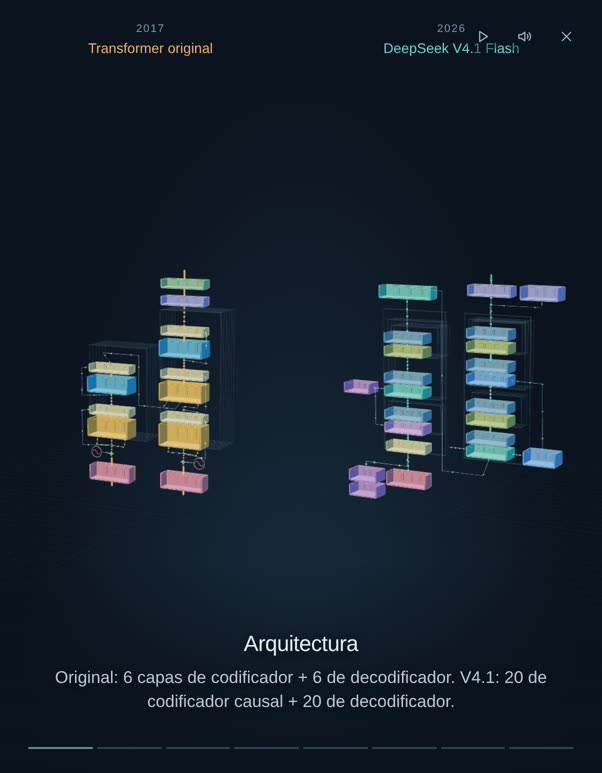
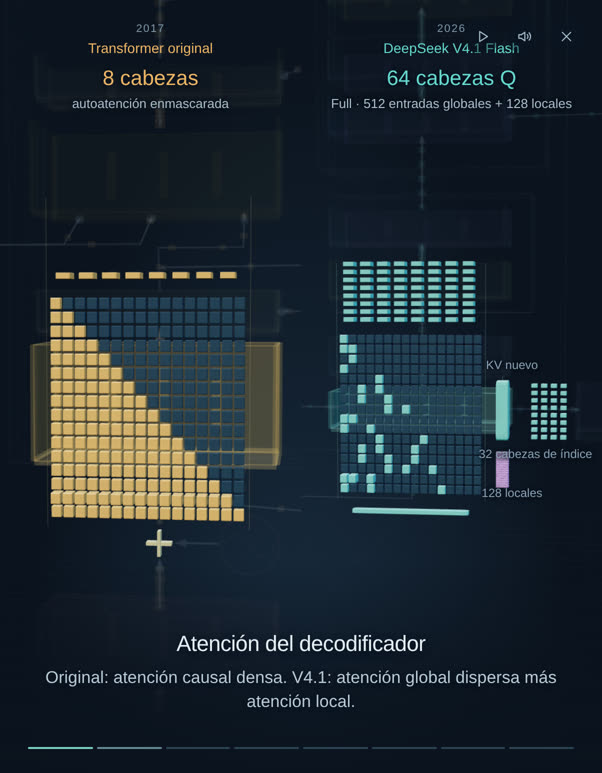

# Arquitectura Transformer

Explora el Transformer original y DeepSeek V4.1 Flash en 3D interactivo. Sigue el flujo de tokens, acércate a cualquier componente o mira el recorrido narrado de un minuto con lo que cambió.

Construido con **GPT-6-Astra** en Codex. Interfaz y narración en español.

**[Abrir la demo original →](https://transformer-architecture.petergostev.chatgpt.site/)**



## Explora

- **Mira la arquitectura completa.** Los dos modelos siguen la estructura de sus artículos, con rutas animadas que conectan los componentes.
- **Asómate dentro.** Haz clic en un componente o acércate a él para ver cabezas de atención, enrutado de expertos, flujos residuales y memoria.
- **Escucha la historia.** Un recorrido de cámara de 60 segundos, **con narración en español**, compara atención, reutilización, expertos, memoria, visión y borradores. Puedes silenciarla con el botón del altavoz.
- **Cambia el contexto.** Ajusta el número de tokens para explorar las ilustraciones de tráfico y caché. Pausa o ralentiza la animación cuando quieras.



## Ejecutar en local

Sin paso de compilación, sin clave de API y sin descargar modelos. Basta con Python 3:

```bash
git clone https://github.com/axellaban/transformer-architecture.git
cd transformer-architecture
python3 -m http.server 8000 --directory dist
```

Abre **http://localhost:8000** en un navegador moderno. La aplicación usa WebGL e incluye sus dependencias de Three.js en local.

## Desplegar en Vercel

El repositorio ya trae [`vercel.json`](vercel.json), así que no hay que configurar nada a mano:

1. En Vercel elige **Add New → Project** e importa este repositorio de GitHub.
2. Deja el framework en **Other**. `vercel.json` ya fija `dist` como directorio de salida y no hay ningún comando de compilación que ejecutar.
3. Pulsa **Deploy**.

Cada push a la rama conectada vuelve a desplegar el sitio. Si prefieres la línea de comandos, `npx vercel` y `npx vercel --prod` funcionan desde la raíz del repositorio.

## Hazlo tuyo

La aplicación es JavaScript, CSS y HTML planos. Edita `dist/` y recarga la página.

| Archivo | Qué contiene |
| --- | --- |
| `dist/app.js` | La escena 3D, el flujo de tokens y las interacciones |
| `dist/i18n.js` | Todo el texto de la interfaz en español |
| `dist/presentation.mjs` | Los cálculos esquemáticos de atención, enrutado y demás |
| `dist/story.mjs` · `dist/camera-path.mjs` | Textos, tiempos y movimiento de cámara de la historia |
| `dist/assets/narracion-es.mp3` | La narración de 60 segundos, alineada con el reloj de la historia |
| `dist/facts.js` · `dist/sources.js` | Datos de arquitectura y notas de las fuentes |
| `blender/architectures.blend` | Modelos de Blender y geometría de detalle editables |
| `scripts/build_spatial_architecture.py` | Regenera los modelos espaciales desde los datos del diagrama |
| `scripts/build_narration.py` | Regenera la narración en español |

Consulta las [notas de desarrollo](docs/development.md) para editar en Blender, regenerar el audio y pasar las comprobaciones.

## Fuentes y alcance

Basado en [Attention Is All You Need](https://arxiv.org/abs/1706.03762) y en el [informe técnico de DeepSeek V4.1 Flash](https://huggingface.co/deepseek-ai/DeepSeek-V4.1-Flash/resolve/main/DeepSeek_V41_Tech_Report.pdf), revisados el 10 de septiembre de 2026. El panel de **Fuentes** de la aplicación explica cada cantidad y cada supuesto; [provenance.json](provenance.json) registra los hashes de fuentes y recursos.

Esto es una visualización educativa. El tráfico de tokens, los patrones de atención y el enrutado son esquemáticos; no ejecutan una red neuronal ni miden la velocidad de inferencia. Las ilustraciones de caché comparan de forma explícita ámbitos de almacenamiento distintos.

## Consumo de la construcción

La sesión principal del proyecto en Codex registró unos **83,7 millones de tokens** hasta la primera publicación en GitHub, el 11 de septiembre de 2026: **80,9 M de entrada en caché**, **2,4 M de entrada sin caché** y **397 K de salida**, razonamiento incluido.

Estas cifras salen de los registros de la sesión e incluyen contexto repetido entre llamadas al modelo; no son la cantidad de texto o de código únicos generados. Aquí están los [recuentos exactos y el método de conteo](docs/build-usage.json), en inglés tal como se registraron.

## Licencia

[MIT](LICENSE) para el código del proyecto, las capturas y los recursos originales de Blender. Three.js conserva su [licencia MIT](dist/vendor/LICENSE). Los artículos y los materiales de los modelos referenciados pertenecen a sus autores; consulta los [avisos de terceros](THIRD_PARTY_NOTICES.md).
